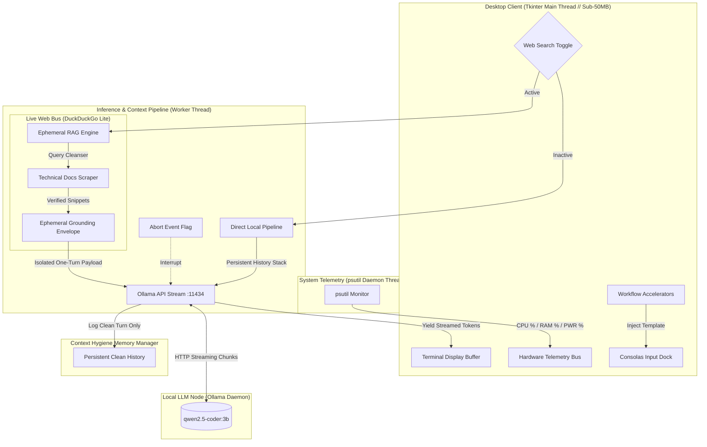

# ⚡ POCKET COPILOT

<div align="center">

```text
  ██████╗  ██████╗  ██████╗██╗  ██╗███████╗████████╗
  ██╔══██╗██╔═══██╗██╔════╝██║ ██╔╝██╔════╝╚══██╔══╝
  ██████╔╝██║   ██║██║     █████═╝ █████╗     ██║   
  ██╔═══╝ ██║   ██║██║     ██╔═██╗ ██╔══╝     ██║   
  ██║     ╚██████╔╝╚██████╗██║ ╚██╗███████╗   ██║   
  ╚═╝      ╚═════╝  ╚═════╝╚═╝  ╚═╝╚══════╝   ╚═╝   
   ██████╗  ██████╗ ██████╗ ██╗██╗      ██████╗ ████████╗
  ██╔════╝ ██╔═══██╗██╔══██╗██║██║     ██╔═══██╗╚══██╔══╝
  ██║      ██║   ██║██████╔╝██║██║     ██║   ██║   ██║   
  ██║      ██║   ██║██╔═══╝ ██║██║     ██║   ██║   ██║   
  ╚██████╗ ╚██████╔╝██║     ██║███████╗╚██████╔╝   ██║   
   ╚═════╝  ╚═════╝ ╚═╝     ╚═╝╚══════╝ ╚═════╝    ╚═╝   
```

**The Sovereign, Zero-Cost Alternative to Browser AI & Cloud Copilots.**  
*An offline-first desktop engineering copilot with an ephemeral live-web grounding engine, zero token limits, and native telemetry.*

---

[-00e5ff?style=for-the-badge&logo=cashapp&logoColor=white)](https://github.com)
[](https://github.com)
[](https://ollama.ai)
[](https://www.python.org/)
[](https://github.com)
[](LICENSE)

</div>

---

## 📑 Table of Contents
- [The Paradigm Shift: Bridging the "Token & Cutoff" Chasm](#-the-paradigm-shift-bridging-the-token--cutoff-chasm)
- [Architectural Pillars](#-architectural-pillars)
  - [1. Offline-First Ephemeral RAG Engine](#1-offline-first-ephemeral-rag-engine)
  - [2. Context Hygiene & Anti-Degradation Pipeline](#2-context-hygiene--anti-degradation-pipeline)
  - [3. Zero-Cost Local Copilot](#3-zero-cost-local-copilot)
- [System Architecture](#-system-architecture)
- [Feature Matrix](#-feature-matrix)
- [Competitive Breakdown](#-competitive-breakdown)
- [Prerequisites & Supported Models](#-prerequisites--supported-models)
- [Quick Start](#-quick-start)
- [Keyboard & Navigation Controls](#-keyboard--navigation-controls)
- [Fine-Tuning Parameters & Model Customization](#-fine-tuning-parameters--model-customization)
- [Project Anatomy](#-project-anatomy)
- [Troubleshooting](#-troubleshooting)
- [License](#-license)

---

## 💡 The Paradigm Shift: Bridging the "Token & Cutoff" Chasm

Modern software development has become tethered to cloud-hosted Large Language Models. While capable, current cloud and browser-based AI solutions impose heavy friction:

1. **The Token Tax & Metered Anxiety**: Cloud providers bill by input and output tokens. Whether you pay per-query API bills or $20–$40/month per-seat SaaS tolls, your usage is monitored, metered, and throttled by strict hourly rate limits.
2. **The Cloud Privacy Leak**: Every snippet of proprietary code, internal architecture diagram, and sensitive bug trace transmitted to browser-based assistants leaves your machine and sits on third-party servers.
3. **The Local SLM Dilemma**: Small Language Models (SLMs) like `qwen2.5-coder:3b` solve the privacy and cost problem—running 100% offline on consumer laptops with unlimited tokens. However, **local models have traditionally been frozen in time**, crippled by static pre-training cutoffs, unaware of newly released library APIs, and susceptible to context degradation and repetitive generation loops.

### 🌉 The Pocket Copilot Solution

**Pocket Copilot bridges this chasm.** It unites the infinite-token, sovereign offline performance of local SLMs with an **on-demand, ephemeral web search bus**.

```
┌─────────────────────────┐          ┌───────────────────────────┐
│     Cloud / Web AI      │          │   Traditional Local SLMs  │
│  • Expensive API Tokens │          │  • 100% Free & Air-gapped │
│  • Strict Rate Limits   │          │  • Infinite Local Tokens  │
│  • Privacy Exfiltration │          │  • FROZEN Training Cutoff │
│  • Bloated Browser Tabs │          │  • Hallucinates New APIs  │
└────────────┬────────────┘          └─────────────┬─────────────┘
             │                                     │
             └──────────────────┬──────────────────┘
                                ▼
         ╔════════════════════════════════════════════╗
         ║               POCKET COPILOT               ║
         ║  ✓ Zero Token Costs (Unlimited Local)     ║
         ║  ✓ Air-Gapped by Default                   ║
         ║  ✓ Ephemeral Live Web Grounding on Demand  ║
         ║  ✓ Anti-Degradation Context Hygiene        ║
         ║  ✓ Sub-50MB Native Desktop Footprint       ║
         ╚════════════════════════════════════════════╝
```

You get a private, desktop-native engineering copilot running entirely on consumer hardware that writes clean algorithms offline—and instantly retrieves live, verified internet documentation when you need bleeding-edge accuracy.

---

## 🏛️ Architectural Pillars

### 1. Offline-First Ephemeral RAG Engine
*Bridging local, privacy-preserving SLMs (`qwen2.5-coder:3b`) with live web grounding on consumer hardware.*

- **Low-Power Consumer Hardware Compatibility**: Optimized specifically for compact coding SLMs (`qwen2.5-coder:3b`, `qwen2.5-coder:1.5b`), enabling instant sub-second token streaming on standard CPU and entry-level GPUs without requiring dedicated VRAM clusters.
- **Zero Vector-Database Overhead (Ephemeral RAG)**: Traditional Retrieval-Augmented Generation (RAG) forces developers to run memory-heavy vector databases (Chroma, Milvus, FAISS) and continuous local embedding models that devour system memory. Pocket Copilot uses an **ephemeral retrieval pipeline**:
  1. Detects operator search intent via an atomic UI toggle (`🌐 WEB AUGMENTATION`).
  2. Strips natural-language conversational filler (`"how do you"`, `"can you"`) to isolate high-signal technical keywords.
  3. Scrapes high-density global technical documentation via an encrypted DuckDuckGo backend.
  4. Synthesizes snippets into an ephemeral grounding envelope that strictly forces the local model to prioritize verified online context over internal pre-training weights.
- **Zero-Storage Footprint**: Web context is ingested in-memory, synthesized during the stream, and released immediately. No gigabytes of vector indices cluttering your disk.

### 2. Context Hygiene & Anti-Degradation Pipeline
*Defeating token repetition loops, preventing memory leakage across turns, and enforcing dynamic task scaffolding.*

Small language models are sensitive to prompt clutter and repetitive attention sinkholes. Pocket Copilot integrates a multi-stage context preservation protocol:

- **Repetition Loop Suppression**: Configured with strict generation dynamics (`repeat_penalty: 1.2`, `repeat_last_n: 64`, `temperature: 0.1`). This prevents the model from falling into runaway token loops, recursive code echoes, or repeating the same syntax blocks.
- **Context Decoupling (Zero Memory Leakage)**: When web search is toggled, feeding hundreds of scraped HTML tokens into persistent conversation history causes severe context pollution, quickly degrading the model's small attention window. Pocket Copilot **isolates the web payload into a one-turn ephemeral prompt wrapper**:
  - The model receives the full context payload for immediate synthesis.
  - The persistent conversation history records *only* the user's core query and the final generated response.
  - The next conversation turn remains pristine, preventing hallucination bleed and context bloat across long sessions.
- **Dynamic Task Scaffolding**: Enforces a strict system directive separating distinct engineering tasks:
  - **Algorithmic / DSA Execution**: Strictly restricted to pure functions, standard libraries, and optimal time/space complexity. Explicitly prevents the model from wrapping simple algorithms in unrequested web frameworks (FastAPI/Flask/HTTP servers).
  - **Web-Service & Architecture Tasks**: Enforces modern industry standards (e.g., FastAPI `lifespan` context managers instead of deprecated `@app.on_event`, Pydantic V2 `@field_validator` with `@classmethod`).
  - **Instant State Purge**: A 1-click `FLUSH CONTEXT` bus completely wipes the conversation stack back to bare system directives without needing to restart the application.

### 3. Zero-Cost Local Copilot
*Developer-grade code assistance with $0 API costs, 100% privacy, and ultra-low system overhead.*

- **$0.00 Token Expenses**: Zero API keys, zero monthly subscriptions, zero card charges. Generate as many tokens, refactor as many modules, and run as many queries as your hardware can crunch.
- **True Air-Gapped Privacy**: By default, no network socket is ever opened. All inference occurs through your local loopback address (`http://127.0.0.1:11434`). Code and prompts never leave your machine unless you explicitly engage the web augmentation toggle.
- **Native Efficiency vs. Electron Bloat**: Modern AI tools (Cursor, VS Code extensions, browser tabs) easily devour 1.5GB to 4GB of RAM. Pocket Copilot is written in pure **Python and Tkinter**, idling at **under 50MB of RAM**. Your CPU cycles and RAM stay dedicated to your build tools, compilers, and Docker containers.

---

## 🏗️ System Architecture



---

## ⚡ Feature Matrix

| Feature | Technical Implementation | Practical Benefit |
| :--- | :--- | :--- |
| **Live Token Streaming** | Multi-threaded producer-consumer queue via Tkinter event loop | Zero UI stuttering or freezes while reading output token-by-token. |
| **Ephemeral Web RAG** | Scrapes live technical documentation on demand; isolates context | Overcomes model knowledge cutoff without polluting conversation memory. |
| **Anti-Loop Dynamics** | `repeat_penalty: 1.2`, `repeat_last_n: 64`, `temp: 0.1` | Eliminates circular generation traps and redundant code blocks. |
| **Instant Abort Switch** | Threaded atomic `threading.Event` interrupt | Immediately kill runaway generation mid-stream without waiting. |
| **Hardware Bus** | Background daemon polling `psutil` every 1.5s | Monitor CPU, RAM, and Battery draw in real-time during heavy inference. |
| **One-Click Flush** | Purges active message array to base system persona | Instant fresh state without closing or restarting the workspace. |
| **Workflow Modules** | Pre-engineered prompt injections for DSA, FastAPI, Bugs, Hooks | Skip repetitive prompt boilerplate with single-click engineering shortcuts. |
| **Integrated Clipboard** | Dynamic in-buffer `[COPY REPLY]` button with auto-reset feedback | Seamlessly grab generated snippets into your IDE without manual selection. |

---

## 📊 Competitive Breakdown

| Capability | **Pocket Copilot** | GitHub Copilot / Cursor | Browser AI (ChatGPT / Claude) | Raw Ollama CLI |
| :--- | :---: | :---: | :---: | :---: |
| **Token Cost** | **$0.00 Forever** | $10–$40 / month | $20 / month or API usage | $0.00 Forever |
| **Token Limits** | **Unlimited** | Rate-limited per minute/hour | Rate-limited / Capped | Unlimited |
| **Air-Gapped Privacy** | **100% Local** (Web is opt-in) | ❌ Cloud Exfiltration | ❌ Cloud Exfiltration | **100% Local** |
| **Live Internet Grounding** | **Yes (Ephemeral RAG)** | Yes (Cloud-tethered) | Yes (Cloud-tethered) | ❌ No (Frozen cutoff) |
| **Context Hygiene** | **Yes (Isolated Web turns)** | Proprietary / Mixed | Prone to context bloat | ❌ No isolation |
| **RAM Footprint** | **< 50 MB** | 800 MB – 2.5 GB (Electron) | 1.0 GB – 3.0 GB (Browser tabs) | CLI only |
| **Works 100% Offline** | **Yes** | ❌ No | ❌ No | **Yes** |

---

## 📦 Prerequisites & Supported Models

### 1. Software Prerequisites
- **Python**: Version 3.10 or higher.
- **Ollama**: Installed and operational. Download from [ollama.com](https://ollama.com).

### 2. Default Model
Pocket Copilot is tuned out-of-the-box for **`qwen2.5-coder:3b`**, which strikes the optimal balance between algorithmic reasoning, syntax precision, and real-time inference speed on consumer hardware:
```bash
ollama pull qwen2.5-coder:3b
```

### 3. Alternative Supported Models
You can run any Ollama model with zero code refactoring:
- `qwen2.5-coder:1.5b` *(Ultra-fast for low-spec dual-core CPUs)*
- `qwen2.5-coder:7b` *(Heavyweight engineering reasoning for 8GB+ VRAM)*
- `deepseek-r1:1.5b` or `deepseek-r1:7b` *(Chain-of-thought algorithmic reasoning)*
- `llama3.2:3b` *(General technical conversation and architecture)*

---

## 🚀 Quick Start

### Step 1: Clone the Repository
```bash
git clone https://github.com/sayakbhattasali/pocket-copilot.git
cd pocket-copilot
```

### Step 2: Install Python Dependencies
```bash
pip install -r requirements.txt
```
*(Installs `ollama`, `psutil`, and `duckduckgo-search` for web augmentation).*

### Step 3: Launch Pocket Copilot

#### 🪟 Windows (1-Click Bootloader):
Double-click [`launch_copilot.bat`](launch_copilot.bat) or run from PowerShell:
```cmd
launch_copilot.bat
```
*This launches the background Ollama daemon automatically if not already active, then opens the cyberpunk workspace.*

#### 🐧 Linux / 🍎 macOS:
Ensure execution permissions and launch:
```bash
chmod +x launch_copilot.sh
./launch_copilot.sh
```

#### 🐍 Direct Python Run:
```bash
python assistant_gui.py
```

---

## ⌨️ Keyboard & Navigation Controls

| Action | Control / Shortcut | Technical Description |
| :--- | :--- | :--- |
| **Transmit Message** | `Enter` | Submits prompt, triggers ephemeral RAG (if enabled), and initiates stream. |
| **Insert Newline** | `Shift + Enter` | Allows complex multiline code inputs without accidental submission. |
| **Toggle Live Web** | `Check [🌐 WEB AUGMENTATION]` | Switches between 100% air-gapped local inference and live web grounding. |
| **Abort Stream** | `Click [■ ABORT]` | Sets atomic thread flag, terminating the HTTP chunk consumer immediately. |
| **Flush Context** | `Click [FLUSH CONTEXT]` | Clears conversation memory arrays; resets tokens back to zero. |
| **Workflow Injection** | `Click [› Module Name]` | Injects battle-tested prompt templates directly into the input dock. |
| **Copy Response** | `Click [COPY REPLY]` | In-buffer utility button to copy formatted output with visual confirmation. |

---

## ⚙️ Fine-Tuning Parameters & Model Customization

All operational controls are transparently exposed in [`assistant_gui.py`](assistant_gui.py):

### Switching Model Nodes
Modify line 20 in `assistant_gui.py`:
```python
MODEL_NAME = "qwen2.5-coder:3b"  # Replace with 'deepseek-r1:1.5b', 'llama3.2', etc.
```

### Hyperparameter Tuning
Inference dynamics are located in `infer_stream_thread()`:
```python
response_stream = ollama.chat(
    model=MODEL_NAME,
    messages=payload,
    options={
        "temperature": 0.1,       # Low temperature prevents hallucinations in code
        "repeat_penalty": 1.2,    # Suppresses cyclic repetition loops
        "repeat_last_n": 64,      # Looks back 64 tokens to enforce output diversity
        "num_ctx": 2048,          # Context window memory budget
    },
    keep_alive="5m",              # Keeps model loaded in RAM for rapid consecutive prompts
    stream=True
)
```

---

## 📁 Project Anatomy

```text
pocket-copilot/
├── .gitignore              # Ignores bytecode, pycache, OS junk, and virtual environments
├── .gitattributes          # Ensures cross-platform newline consistency
├── assistant_gui.py        # Core Tkinter Cyberpunk UI, Ephemeral RAG, & Telemetry Bus
├── launch_copilot.bat      # 1-Click Windows bootloader (launches Ollama daemon + UI)
├── launch_copilot.sh       # 1-Click Linux/macOS bootloader
├── requirements.txt        # Runtime dependencies (ollama, psutil, duckduckgo-search)
├── LICENSE                 # MIT Open-Source License
└── README.md               # System documentation & technical specification
```

---

## 🔧 Troubleshooting

<details>
<summary><b>1. "Stream pipeline fault: Connection refused / Failed to connect to Ollama"</b></summary>

- The Ollama local daemon is not running. Launch it manually in a terminal:
  ```bash
  ollama serve
  ```
- Test daemon availability:
  ```bash
  curl http://localhost:11434
  # Should respond: "Ollama is running"
  ```
</details>

<details>
<summary><b>2. "Model 'qwen2.5-coder:3b' not found"</b></summary>

- Pull the model into your local Ollama library:
  ```bash
  ollama pull qwen2.5-coder:3b
  ```
- Check installed models anytime with:
  ```bash
  ollama list
  ```
</details>

<details>
<summary><b>3. Web Augmentation is disabled / Grayed out</b></summary>

- Web augmentation requires `duckduckgo-search`:
  ```bash
  pip install duckduckgo-search
  ```
- Restart Pocket Copilot once installed.
</details>

<details>
<summary><b>4. Linux: "ModuleNotFoundError: No module named 'tkinter'"</b></summary>

- On Debian/Ubuntu environments, Tkinter must be installed via apt:
  ```bash
  sudo apt update && sudo apt install python3-tk
  ```
</details>

---

## 📄 License

This project is licensed under the **MIT License** — see the [LICENSE](LICENSE) file for details.

<div align="center">
  <sub>Engineered for local-first, zero-cost, sovereign AI development. No subscription. No tokens. No cloud telemetry.</sub>
</div>
