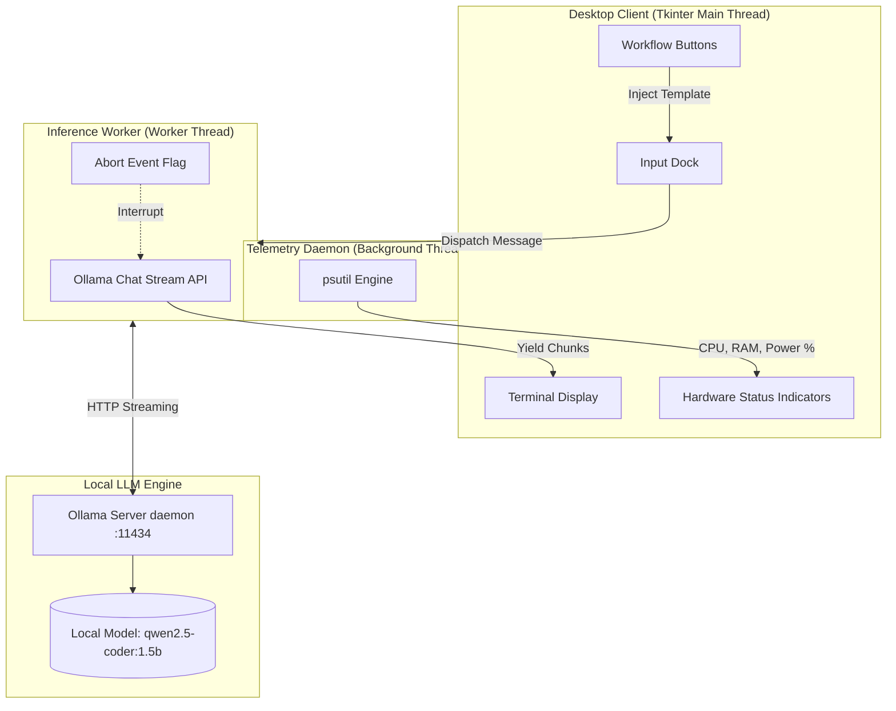

# ⚡ POCKET COPILOT

<div align="center">

```text
  ██████╗  ██████╗  ██████╗██╗  ██╗███████╗████████╗
  ██╔══██╗██╔═══██╗██╔════╝██║ ██╔╝██╔════╝╚══██╔══╝
  ██████╔╝██║   ██║██║     █████═╝ █████╗     ██║   
  ██╔═══╝ ██║   ██║██║     ██╔═██╗ ██╔══╝     ██║   
  ██║     ╚██████╔╝╚██████╗██║ ╚██╗███████╗   ██║   
  ╚═╝      ╚═════╝  ╚═════╝╚═╝  ╚═╝╚══════╝   ╚═╝   
   ██████╗  ██████╗ ██████╗ ██╗██╗      ██████╗ ████████╗
  ██╔════╝ ██╔═══██╗██╔══██╗██║██║     ██╔═══██╗╚══██╔══╝
  ██║      ██║   ██║██████╔╝██║██║     ██║   ██║   ██║   
  ██║      ██║   ██║██╔═══╝ ██║██║     ██║   ██║   ██║   
  ╚██████╗ ╚██████╔╝██║     ██║███████╗╚██████╔╝   ██║   
   ╚═════╝  ╚═════╝ ╚═╝     ╚═╝╚══════╝ ╚═════╝    ╚═╝   
```

**An air-gapped, cyberpunk-styled local AI engineering copilot & system telemetry console.**  
*Powered by Ollama, Python Tkinter, and real-time hardware monitoring.*

---

[](https://www.python.org/)
[](https://ollama.ai)
[](LICENSE)
[](https://github.com)
[](https://github.com)

</div>

---

## 📑 Table of Contents
- [Overview](#-overview)
- [Key Features](#-key-features)
- [Architecture](#-architecture)
- [Prerequisites](#-prerequisites)
- [Quick Start](#-quick-start)
- [Keyboard & Navigation Controls](#-keyboard--navigation-controls)
- [Switching & Customizing Models](#-switching--customizing-models)
- [Project Structure](#-project-structure)
- [Troubleshooting](#-troubleshooting)
- [Contributing](#-contributing)
- [License](#-license)

---

## 🌐 Overview

**Pocket Copilot** is a lightweight, zero-latency desktop AI copilot engineered for software developers, algorithmic problem solvers, and system engineers. Designed with a dark cyberpunk terminal interface, it runs completely on your local machine using **Ollama**—ensuring **zero data leakage**, **no cloud subscription fees**, and **uncompromised speed**.

Unlike bulky web wrappers or heavy Electron apps, Pocket Copilot is built natively in Python with zero frontend framework overhead.

---

## ✨ Key Features

| Feature | Description |
| :--- | :--- |
| ⚡ **Live Token Streaming** | Non-blocking token-by-token streaming inference running on a dedicated worker thread. |
| 🛑 **Instant Stream Abort** | Immediate `■ ABORT` interrupt button to halt runaway LLM responses mid-generation. |
| 📊 **Hardware Telemetry Bus** | Live, real-time background monitor tracking **CPU load %**, **RAM utilization %**, and **Power / Battery** status via `psutil`. |
| 🎛️ **Workflow Modules** | 1-click accelerated prompt injection presets: **DSA Complexity Check**, **FastAPI Boilerplates**, **Bug Diagnosis**, and **React Custom Hooks**. |
| 🧹 **Context Purge Engine** | One-click **FLUSH CONTEXT** button to instantly purge conversation history without restarting the application. |
| 🔒 **100% Air-Gapped & Private** | No external APIs, no analytics, no third-party tracking. All prompts and code stay on your device. |
| 🎨 **Cyberpunk Terminal Aesthetic** | Monospaced Consolas typography, high-contrast neon cyan & matrix green tags, dark slate theme (`#08090c`). |

---

## 🏗️ Architecture



---

## 📦 Prerequisites

Ensure you have the following installed on your host system:

1. **Python 3.10+** (Tested on Python 3.10, 3.11, 3.12, 3.13)
2. **Ollama**: Download and install from [ollama.com](https://ollama.com)
3. **Target LLM Model**: Pull the default high-performance coding model:
   ```bash
   ollama pull qwen2.5-coder:1.5b
   ```
   *(Or any preferred model such as `llama3.2`, `deepseek-r1:1.5b`, `mistral`, etc.)*

---

## 🚀 Quick Start

### 1. Clone the Repository
```bash
git clone https://github.com/sayakbhattasali/pocket-copilot.git
cd pocket-copilot
```

### 2. Install Python Dependencies
```bash
pip install -r requirements.txt
```

### 3. Launch the Application

#### 🪟 Windows:
Double-click [`launch_copilot.bat`](file:///c:/Users/KIIT0001/Desktop/idk-what-is-this/native-ai/launch_copilot.bat) or run from Command Prompt / PowerShell:
```cmd
launch_copilot.bat
```
*This script will automatically start the background Ollama daemon if it is not already running, then launch the GUI.*

#### 🐧 Linux / 🍎 macOS:
Make the bash script executable and run:
```bash
chmod +x launch_copilot.sh
./launch_copilot.sh
```

#### 🐍 Direct Python Execution:
```bash
python assistant_gui.py
```

---

## ⌨️ Keyboard & Navigation Controls

| Action | Control / Shortcut | Description |
| :--- | :--- | :--- |
| **Transmit Prompt** | `Enter` | Sends the current prompt and initiates streaming inference. |
| **Multiline Input** | `Shift + Enter` | Inserts a new line in the input box without sending. |
| **Abort Generation** | `Click [■ ABORT]` | Immediately stops stream reception and frees UI control. |
| **Flush Context** | `Click [FLUSH CONTEXT]` | Clears active conversation memory while preserving system persona. |
| **Workflow Injection** | `Click [› Module Name]` | Injects tailored technical prompt templates into the prompt dock. |

---

## ⚙️ Switching & Customizing Models

By default, the application runs on **`qwen2.5-coder:1.5b`**, which offers lightning-fast inference on CPU or modest GPUs.

To switch models:
1. Pull your desired model via Ollama:
   ```bash
   ollama pull deepseek-r1:1.5b
   # or
   ollama pull llama3.2
   ```
2. Open [`assistant_gui.py`](file:///c:/Users/KIIT0001/Desktop/idk-what-is-this/native-ai/assistant_gui.py) and update line 9:
   ```python
   MODEL_NAME = "deepseek-r1:1.5b"  # Replace with your desired model tag
   ```
3. Restart the workspace. The header badge and generation thread will automatically synchronize with your new node.

---

## 📁 Project Structure

```text
pocket-copilot/
├── .gitignore              # Ignores bytecode, caches, logs, environments, and OS artifacts
├── .gitattributes          # Enforces consistent line endings across platforms
├── assistant_gui.py        # Core Tkinter Cyberpunk GUI, streaming loop & telemetry bus
├── launch_copilot.bat      # 1-Click Windows bootloader (launches Ollama + GUI)
├── launch_copilot.sh       # 1-Click Linux/macOS bootloader
├── requirements.txt        # Runtime third-party requirements (ollama, psutil)
├── LICENSE                 # MIT Open Source License
└── README.md               # Project documentation and guide
```

---

## 🔧 Troubleshooting

<details>
<summary><b>1. "Stream pipeline fault: Connection refused / Failed to connect to Ollama"</b></summary>

- Ensure the Ollama background daemon is running:
  ```bash
  ollama serve
  ```
- Test Ollama status in your browser or terminal:
  ```bash
  curl http://localhost:11434
  # Output should say: "Ollama is running"
  ```
</details>

<details>
<summary><b>2. "Model 'qwen2.5-coder:1.5b' not found"</b></summary>

- Pull the model before launching:
  ```bash
  ollama pull qwen2.5-coder:1.5b
  ```
- Run `ollama list` to verify all installed local models.
</details>

<details>
<summary><b>3. Linux: "ModuleNotFoundError: No module named 'tkinter'"</b></summary>

On some Linux distributions (such as Ubuntu/Debian), Tkinter must be installed via the system package manager:
```bash
sudo apt update
sudo apt install python3-tk
```
</details>

---

## 🤝 Contributing

Contributions, feature suggestions, and bug reports are welcome!
1. Fork the repository
2. Create your feature branch (`git checkout -b feature/cyber-feature`)
3. Commit your changes (`git commit -m 'Add some cyber enhancement'`)
4. Push to the branch (`git push origin feature/cyber-feature`)
5. Open a Pull Request

---

## 📄 License

Distributed under the **MIT License**. See [`LICENSE`](LICENSE) for more information.

<div align="center">
  <sub>Engineered for local-first, low-latency, sovereign AI development.</sub>
</div>
